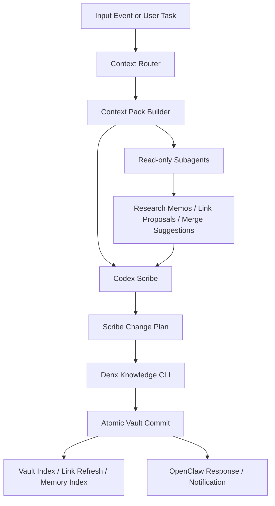
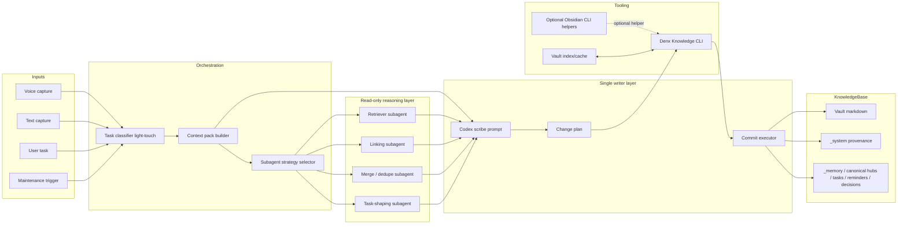
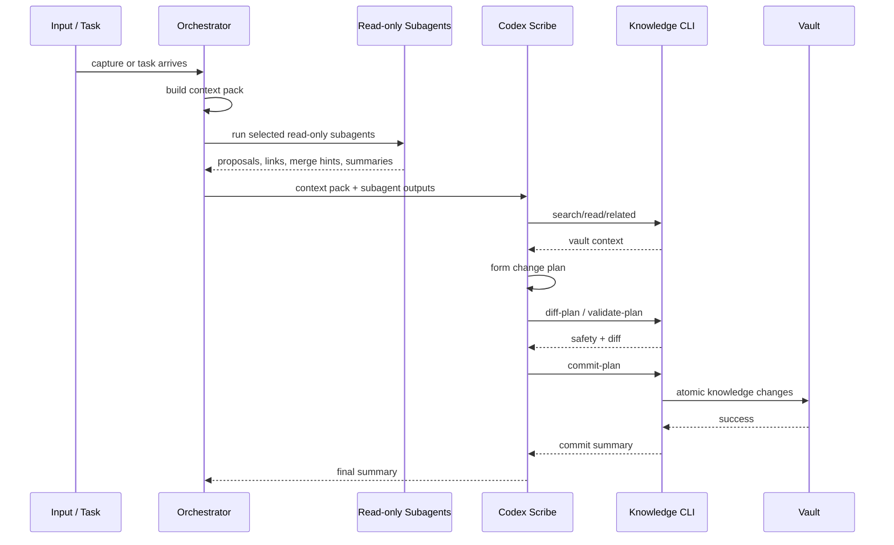

# Denx v3 — Prompt-Driven Codex Scribe Architecture

Status: proposal
Owner: Denizcan
Design target: Denx v3

## TL;DR

Denx v3 should keep the **single-writer rule** for the knowledge base, but evolve the writer from a narrow validator-heavy ingestion pipeline into a **prompt-driven scribe system**.

The core move:

- **Codex becomes the scribe**
- **Subagents become read-only researchers / synthesizers**
- **One writer commits knowledge changes**
- **Validators are eliminated or demoted into lightweight guardrails**
- **A vault CLI becomes the stable action surface** instead of ad hoc direct mutation logic spread across services
- **Prompting, not rigid schema branching, becomes the main intelligence layer**

This preserves consistency while giving models more room to:

- discover non-obvious links
- merge duplicate concepts
- strengthen canonical notes
- reshape knowledge differently depending on the task
- improve over time as frontier models improve

---

## Why v3

The current Denx architecture is directionally right:

- one writer
- local-first
- transcript provenance preserved
- Codex already involved in shaping knowledge

But the current shape still leans too much on a classic ingestion mindset:

- classify first
- validate heavily
- write into predefined buckets
- constrain the agent tightly to avoid drift

That works for reliability, but it leaves capability on the table.

What matters next is not just *correct ingestion*.
It is **useful knowledge evolution**.

The knowledge system should be able to:

1. connect a new capture to older material in deeper ways
2. decide when to update an existing canonical note instead of creating a new one
3. reshape prior knowledge in light of new evidence
4. produce different knowledge artifacts depending on the operating mode
5. let smarter future models improve the graph instead of being trapped by yesterday’s rigid validators

Denx v3 is the design for that shift.

---

## Design goals

1. **Keep one writer**
   - no parallel vault mutation by multiple agents
   - all durable edits flow through one scribe authority

2. **Be prompt-driven**
   - prompts define behavior, judgment, and shaping strategy
   - code defines guardrails and tools, not brittle intelligence

3. **Increase creative reasoning safely**
   - allow broader synthesis, linking, merging, and reframing
   - keep commits reviewable and bounded

4. **Make the knowledge base an active graph**
   - not just a storage sink for transcripts
   - notes can be merged, elevated, demoted, split, or connected

5. **Separate thinking from writing**
   - subagents can explore and propose
   - only the scribe can commit

6. **Future-proof the system**
   - as models get better, most capability gains should come from prompts + orchestration, not rewriting the entire pipeline

---

## Core architectural thesis

### v2 mental model

`capture -> transcribe -> classify -> validate -> write`

### v3 mental model

`capture or task -> gather context -> multi-angle read-only reasoning -> scribe plan -> atomic knowledge commit`

The key difference is that v3 treats vault evolution as an **agentic editorial task**, not a thin ETL pipeline.

---

## Main concepts

### 1. Codex as Scribe

Codex becomes the **only durable writer** to the knowledge base.

Responsibilities:

- read the task or capture
- inspect relevant vault context
- decide whether to create, update, merge, split, link, or leave unchanged
- produce an explicit change plan
- execute changes through a stable CLI
- emit a structured commit summary

The scribe is not just a formatter.
It is the knowledge editor.

### 2. Read-only subagents

Subagents are used for creativity and parallel exploration, but remain **read-only**.

Responsibilities:

- search and summarize relevant prior knowledge
- propose candidate links
- identify duplication or fragmentation
- suggest alternative note structures
- provide task-specific perspectives
- score ambiguity / confidence / conflict

Non-responsibilities:

- no direct vault writes
- no commit authority
- no source-of-truth mutation

This is a strong design because it allows broad reasoning without inviting graph corruption.

### 3. Vault CLI as the action surface

Instead of letting every part of the system mutate markdown directly in bespoke ways, create a **Denx knowledge CLI**.

Possible options:

- evolve a custom Denx CLI
- optionally use Obsidian CLI where useful as a helper
- but keep Denx’s own CLI as the canonical write surface

The CLI should expose stable primitives like:

- `search`
- `read`
- `related`
- `create-note`
- `update-note`
- `append-section`
- `merge-notes`
- `link-notes`
- `move-note`
- `archive-note`
- `record-transcript`
- `record-memory`
- `commit-plan`
- `diff-plan`

The important thing is not whether the implementation uses direct markdown edits under the hood.
The important thing is that the **agent sees a coherent tool interface** for knowledge actions.

### 4. Validators become guardrails, not governors

In v3, “validators” should mostly disappear as first-class intelligence components.

Replace heavy validator logic with:

- CLI-level safety checks
- frontmatter normalization
- path validity checks
- note existence checks
- merge conflict checks
- dry-run diffing
- provenance requirements
- optional human-review mode for high-impact rewrites

The system should stop pretending validation can do the job of judgment.
The model should do the judgment.
The software should make that judgment safe, inspectable, and reversible.

---

## Proposed operating modes

The same architecture should support multiple modes.

### Mode A — Capture Scribe
Input is a voice or text capture.
Goal is to convert it into durable knowledge changes.

### Mode B — Task-Driven Knowledge Work
Input is a task like:

- “prepare for 1:1 with X”
- “clean up networking project notes”
- “build the support plan for Mom”
- “synthesize what I believe about AI safety and leadership”

Goal is not just ingestion.
Goal is **knowledge shaping around a task**.

### Mode C — Graph Maintenance
Background or explicit maintenance work:

- merge duplicates
- strengthen hub notes
- fix stale links
- consolidate project updates
- promote stable recurring ideas into canonical notes

### Mode D — Memory Distillation
Given a cluster of related notes/transcripts, derive a more durable and higher-signal representation.

This is where model improvement matters most over time.

---

## High-level architecture



---

## Detailed architecture sketch



---

## New control plane: prompt-first, tool-backed

The control plane should be:

- **Prompt = policy and intelligence**
- **CLI = capability surface**
- **Code = orchestration + safety + observability**

This is the right split because prompt edits are much cheaper than architecture rewrites.

---

## What to eliminate

### Eliminate

- rigid validator chains pretending to be reasoning
- brittle mandatory type classification too early in the pipeline
- excessive hardcoded branching by note type
- scattered file-write logic across multiple services
- subagents that can independently mutate the vault

### Keep, but demote

- normalization
- path safety
- frontmatter conformance
- basic schema guarantees
- diff review
- provenance recording

These should exist, but as **safety rails**, not as the brain.

---

## Knowledge CLI design

The best long-term path is likely a **custom Denx CLI** with optional adapters to Obsidian CLI where helpful.

Why not pure Obsidian CLI:

- Denx needs domain-specific operations, not just note CRUD
- we want graph-aware actions like merge, canonicalize, and provenance-aware commits
- we want a stable agent tool surface independent of any app-specific lifecycle

### Example CLI shape

```bash
# read/search
kb search "shivam upset support"
kb read notes/people/shivam.md
kb related projects/netai.md --depth 2

# planning
kb diff-plan plan.json
kb validate-plan plan.json

# writing
kb create-note --type note --title "NetAI thesis" --from-file body.md
kb update-note projects/netai.md --patch-file patch.md
kb merge-notes notes/foo.md notes/bar.md --into notes/foo.md
kb link-notes notes/foo.md notes/baz.md --relation related
kb commit-plan plan.json
```

### Important property

The CLI should let the agent express **intent**, not low-level file surgery.

That keeps the system inspectable and lets the implementation evolve without rewriting prompts every time.

---

## The v3 prompt strategy

The most important part of v3 is the **scribe prompt**.

The prompt should not merely ask Codex to classify input.
It should position Codex as:

- archivist
- editor
- synthesizer
- graph maintainer
- provenance-aware scribe

### System role for the Codex Scribe

Below is a proposed prompt draft.

---

## Proposed prompt — Codex Scribe v3

```md
You are the Denx Codex Scribe.

Your job is not to transcribe blindly or file notes mechanically.
Your job is to maintain a high-quality personal knowledge base for Denizcan.

You are the only writer.
Other subagents may search, analyze, compare, and propose changes, but they are read-only.
You alone decide what durable knowledge changes should be committed.

## Mission

Given a new capture, task, or maintenance request:

1. understand the true meaning and likely future value
2. inspect relevant existing knowledge before writing anything new
3. prefer strengthening canonical existing notes over creating duplicates
4. create, update, merge, split, link, or leave unchanged based on what best improves the knowledge base
5. preserve provenance, reversibility, and clarity
6. optimize for future retrieval, decision support, and real-world usefulness

## Core principles

- The knowledge base is a living graph, not a transcript dump.
- Durable knowledge matters more than raw completeness.
- Existing canonical notes should usually be improved before new sibling notes are created.
- New notes should exist only when they increase clarity, retrieval, or future leverage.
- A note may need to be merged, rewritten, elevated, or demoted depending on context.
- Use judgment, not rigid schemas, when deciding the right representation.
- Keep source provenance for important claims and transformations.
- Do not preserve noise just because it exists.
- Avoid fragmentation.
- Prefer strong hubs, strong links, and durable summaries.

## Allowed actions

You may use the knowledge CLI to:
- search the vault
- read notes
- inspect related notes
- create notes
- update notes
- append sections
- merge notes
- link notes
- archive or move stale notes
- record transcript provenance
- commit an atomic plan

## Subagent strategy

You may request or consume outputs from read-only subagents.
Use them when it improves judgment, especially for:
- broad retrieval across the graph
- candidate backlinks and hidden connections
- duplicate detection
- alternate structural proposals
- task-specific reframing

Treat subagent outputs as advisory, not authoritative.
They cannot commit changes.
If subagents disagree, use your own judgment and explain the chosen direction in the plan summary.

## Decision policy

For each task or capture, decide among these actions:
- no durable change
- update an existing note
- create one new note
- create a small set of linked notes
- merge duplicated notes
- strengthen hub notes and backlinks
- distill several weak notes into one stronger canonical note
- store only provenance and defer durable promotion

## Output discipline

Before committing, produce a concise internal plan containing:
- what should change
- why it should change
- which existing notes were considered
- whether this is create/update/merge/link/archive/no-op
- what provenance will be retained
- confidence level and any ambiguity

Then commit using the CLI as one atomic change set where possible.

## Strong preferences

Prefer:
- updating canonical project, person, and system notes
- merging duplicate ideas
- richer linking when it improves later retrieval
- durable summaries over raw diary-like repetition
- notes that will still make sense months later

Avoid:
- creating lots of shallow notes
- promoting casual banter into durable knowledge
- duplicating existing concepts with slightly different names
- rigidly forcing every input into a preset category
- preserving stale structures when a better one is obvious

## Task-sensitive shaping

Different tasks need different knowledge morphologies.
For example:
- a reminder should become an action-oriented artifact
- a project insight should strengthen the relevant project hub and related decisions
- a personal reflection may belong in memory, a principle note, or nowhere durable at all
- a relationship insight may strengthen a person note plus a follow-up reminder

Shape the knowledge based on future usefulness, not on a narrow ingestion template.

## Final standard

Act like a careful, intelligent editor of a living personal operating system.
Not a clerk. Not a validator. Not a transcript router.
A scribe.
```

---

## Subagent strategy

The subagent layer should be explicit, lightweight, and read-only.

### Why read-only subagents are a good idea

This is likely the right compromise.

Benefits:

- parallel search without graph corruption
- creativity without authority sprawl
- broad retrieval over large vault sections
- alternative note-shaping ideas
- easier debugging because only one actor writes
- simpler trust model

### Suggested subagent types

#### 1. Retriever subagent
Purpose:
- gather candidate relevant notes
- summarize prior context
- identify likely canonical hubs

#### 2. Linking subagent
Purpose:
- propose backlinks, related topics, people, projects, and decisions
- identify missing cross-note structure

#### 3. Merge / dedupe subagent
Purpose:
- find overlapping notes
- suggest consolidation targets
- identify fragmentation smells

#### 4. Task-shaping subagent
Purpose:
- adapt the representation to the current task
- example: prep brief, reminder graph, project synthesis, relationship memory

### Subagent invocation policy

Do not always invoke all subagents.
Use a strategy selector.

Example:

- trivial capture -> retriever only or no subagents
- project update -> retriever + linking
- messy repeated topic -> retriever + merge/dedupe + linking
- high-level synthesis task -> all four

---

## Scribe execution loop



---

## Data model implications

v3 should bias the graph toward stronger canonical notes.

### Likely stable note families

- people
- projects
- decisions
- reminders
- tasks
- principles / beliefs
- systems / architecture
- memory
- daily notes
- provenance under `_system`

### Important change

The system should feel free to:

- update an existing person note instead of making a fresh note
- add a project update into a project hub instead of a disconnected leaf
- turn recurring fragments into a stronger canonical topic note
- demote weak notes to provenance if they lack durable value

This is the “knowledge morphing” part that matters.

---

## Suggested write protocol

Every durable write should produce:

1. **plan summary**
2. **affected paths**
3. **reason for each change**
4. **source provenance**
5. **diff or patch record**
6. **commit id or change id**

This gives reversibility without reintroducing validator bureaucracy.

---

## How creativity stays safe

The fear with more agent creativity is uncontrolled drift.
The answer is not to suffocate the model.
The answer is to bound the write path.

Safety comes from:

- one writer
- read-only subagents
- CLI-mediated actions
- atomic plans
- diffs
- provenance
- rollback capability
- optional review thresholds for high-impact merges or rewrites

That gives the model room to think while keeping the system governable.

---

## Migration path from current Denx to v3

### Phase 1 — Introduce the CLI surface

- build `kb` / Denx knowledge CLI
- wrap existing vault operations behind CLI commands
- keep current pipeline, but route writes through CLI

### Phase 2 — Promote Codex from classifier to scribe

- replace narrow ingestion prompt with the v3 scribe prompt
- shift output from type classification to change planning
- keep current categories only as soft priors

### Phase 3 — Add read-only subagents

- implement retrieval, linking, and dedupe subagents
- pass their outputs into the scribe prompt
- forbid all direct writes outside scribe

### Phase 4 — Demote validators

- remove brittle decision logic from validators
- keep only mechanical guardrails in CLI and commit stage
- add dry-run diff and rollback tools

### Phase 5 — Expand task-driven knowledge work

- support non-capture prompts like synthesis, planning, and graph maintenance
- let Denx operate as a knowledge editor, not just an ingestion backend

---

## Comparison: direct file writes vs Obsidian CLI vs custom CLI

| Option | Pros | Cons | Recommendation |
|---|---|---|---|
| Direct file writes only | simple, fast, local | leaks write logic across code, poor agent abstraction | not ideal as the exposed agent interface |
| Obsidian CLI | existing ecosystem, app-adjacent | not tailored to graph editing or provenance | useful helper only |
| Custom Denx knowledge CLI | task-specific, stable, graph-aware, agent-friendly | requires design work | best canonical action surface |

Recommendation:

- **Build a custom Denx knowledge CLI**
- optionally call Obsidian CLI under the hood for some operations if it helps
- keep markdown-on-disk as the real persistence layer

---

## What success looks like

A year from now, success is:

- Denx can ingest a voice note, a planning request, or a synthesis task using the same architecture
- the vault gets cleaner over time instead of noisier
- project, person, and memory hubs become stronger
- duplicate notes decrease
- links become more meaningful
- the system uses better models without needing redesign
- OpenClaw handles communication and orchestration
- Codex remains the trusted scribe

---

## Concrete recommendation

If choosing the shape today, choose this:

1. **Codex as the only writer**
2. **Read-only subagents for retrieval, linking, dedupe, and task-shaping**
3. **Custom Denx knowledge CLI as the canonical tool surface**
4. **Validators reduced to mechanical safety checks**
5. **Prompt-driven scribe behavior as the center of the system**
6. **Task-driven knowledge morphing as a first-class feature, not an edge case**

That is the cleanest path to a Denx v3 that gets more powerful as models get smarter instead of being boxed in by old ingestion architecture.

---

## Open questions

1. Should high-impact merges require automatic review mode?
2. Should the scribe maintain a confidence threshold for no-op vs commit?
3. Should the CLI expose semantic graph ops directly, or should the scribe compose them from simpler file ops?
4. How should memory notes vs project notes be prioritized when the same capture touches identity and execution?
5. Should some maintenance jobs run proactively in low-priority background windows?

---

## Next build steps

1. define the CLI command surface
2. rewrite the Codex prompt from classifier to scribe
3. implement read-only subagent contracts
4. route current writes through plan -> diff -> commit
5. test on real capture history and graph-cleanup tasks
6. only then delete the old validator-heavy pathways

---

## Current implementation note: Obsidian CLI vs direct vault access

According to the current Denx implementation, the Codex Denx agent should prefer **direct interaction with the vault files through Denx's own file-backed vault layer**, not Obsidian CLI, for read/edit/write work.

Recommendation:

- for current Denx, use the existing direct vault path as the canonical persistence path
- specifically, keep read/edit/write operations centered on `VaultStore`-style file operations
- if a cleaner tool surface is needed for the agent, expose a Denx CLI that wraps those same operations
- do **not** make Obsidian CLI the primary write surface for the Codex scribe

Rationale grounded in the current implementation:

- the live implementation already reads and writes the vault directly on disk via `VaultStore`
- `VaultAssistantService` applies agent actions by calling direct file-backed methods like `createNote`, `appendToSection`, `setStatus`, `linkNotes`, and `refreshKnowledgeGraph`
- the current `denx` CLI is a thin wrapper over that same runtime and vault layer, not a separate Obsidian-backed control plane
- the repository docs already state that the vault is updated directly on disk and that direct file writes are the primary path
- the local machine context currently says `obsidian-cli` is not installed, so making it the primary agent interface would add a dependency that the implementation does not currently rely on

Concrete conclusion:

- for **today's Denx**, direct vault access is the better choice
- for **Denx v3**, the right evolution is a custom Denx knowledge CLI over the same file-backed primitives, not a shift to Obsidian CLI as the core persistence mechanism
