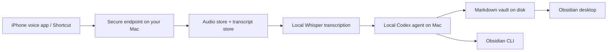

# Local Codex Assistant Architecture

This is the recommended shape for your "talk from anywhere, think on my Mac" setup.

## What Runs Where

### On iPhone

- A Denx client sends text or audio to your Mac over the internet.
- The phone is just the capture client.

### On Your Mac

- A small always-on capture server receives audio.
- A local Whisper-class transcription worker converts audio to text.
- A local Codex agent runs with your ChatGPT-linked Codex login.
- The agent reads and updates your Obsidian vault on disk.
- Obsidian opens that same vault locally.

## Recommended Architecture



## The Local Agent

The local agent should be Codex running on your Mac, not on the iPhone.

Why:

- Codex local usage is officially supported through Codex CLI, IDE extension, and desktop app with ChatGPT sign-in.
- Your vault lives on your Mac, so local filesystem access is the cleanest and safest control surface.
- You can let the phone stay simple and stateless.

## How ChatGPT Account Sign-In Fits

OpenAI currently supports signing in to Codex CLI with your ChatGPT account using:

```bash
codex --login
```

That links your ChatGPT identity and stores local CLI credentials automatically, so you do not need to manually paste an API key into Codex CLI.

## How Obsidian Fits

There are two useful control surfaces:

1. Direct filesystem edits
   - Best for durable note creation, editing, linking, and indexing.

2. Obsidian CLI
   - Best for app-native actions like opening notes, using vault-native search, or interacting with the running Obsidian app.

Because the vault is just markdown files, the local agent should prefer direct file edits first and use Obsidian CLI when it genuinely adds value.

## Anywhere Access To Your Mac

Use one of these:

1. Tailscale
   - Best default option.
   - Your iPhone can securely hit your Mac without exposing a public port.

2. Reverse proxy with HTTPS
   - More flexible, but more setup and more security responsibility.

3. Cloud relay
   - Useful if your Mac is not always directly reachable, but adds more moving pieces.

## Recommended First Version

Keep it simple:

1. Run the capture server on your Mac.
2. Put your Mac and iPhone on Tailscale.
3. Create an iPhone Shortcut that uses `Record Audio`.
4. Point the Shortcut to the Tailscale URL or IP.
5. Let the server transcribe locally, hand the transcript to local Codex, and write the vault.

## Suggested Operational Split

- Capture server:
  Receives audio, stores files, triggers local processing.

- Codex local assistant:
  Reads transcript + vault context, decides what to create/update, edits markdown, optionally uses Obsidian CLI.

- Obsidian:
  Human-facing reading, browsing, graph, backlinks, and manual editing.

## Prompt

Use this prompt for the local Codex agent:

[personal-knowledge-codex.md](../prompts/personal-knowledge-codex.md)

## Recommended Commands

Local Codex sign-in:

```bash
codex --login
```

Start the capture server:

```bash
npm run dev:server
```

Run a local smoke test:

```bash
npx tsx src/cli/index.ts capture --text "Remember to follow up with Sam about the Atlas launch."
```

Doctor check:

```bash
npx tsx src/cli/index.ts doctor
```

If the doctor output says `Agent backend: codex-cli`, your Mac is ready for text-first iPhone capture without an API key.
