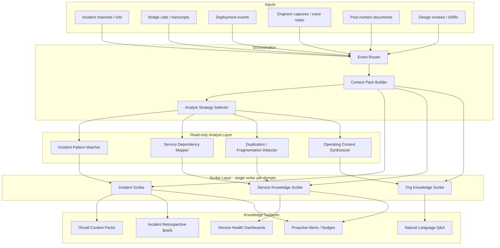
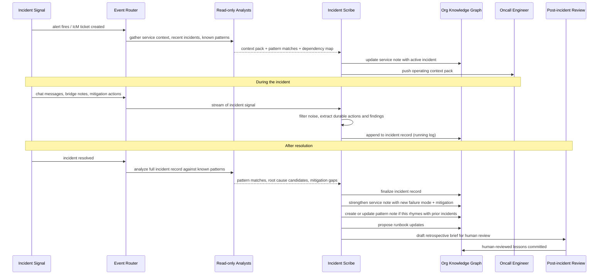
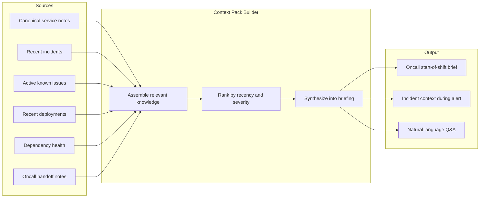
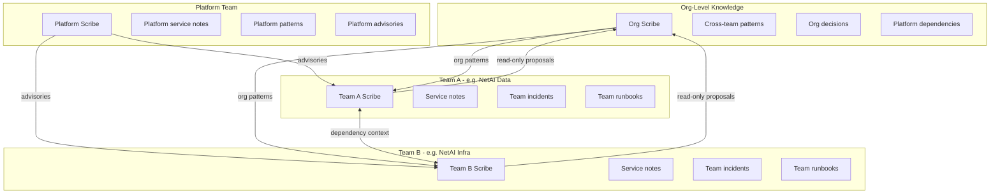
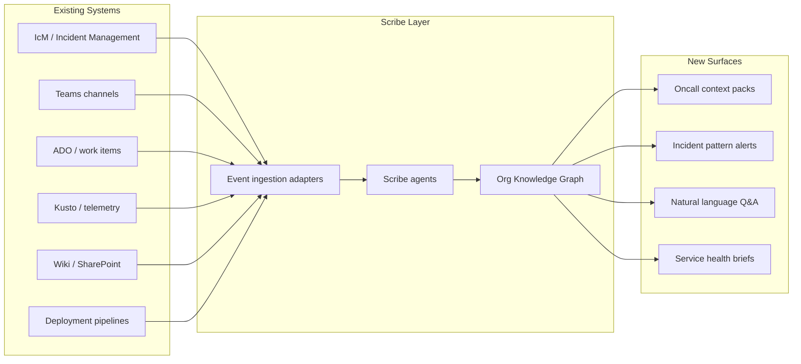

# NetAI Incident-Org Knowledge Architecture

Status: proposal
Owner: Denizcan
Design target: Organizational knowledge layer for NetAI and Microsoft-scale teams

## TL;DR

Denx proves that a prompt-driven scribe with a single-writer rule can maintain a high-quality personal knowledge graph. This document explores how the same architectural thesis scales to **organizational knowledge**, specifically around **incident response, operating context, and durable team memory** for a team like NetAI operating inside Microsoft.

The core idea: an organization's operating knowledge should be a living graph maintained by scribe agents, not a graveyard of wikis, stale runbooks, and unread post-mortems.

---

## Why organizational knowledge breaks

Most engineering organizations at Microsoft's scale suffer from the same failure modes:

1. **Knowledge is write-once, read-never.** Post-mortems are written, filed in a wiki, and never consulted again. The same incident patterns repeat because the durable lessons are buried.

2. **Context lives in people, not systems.** When an engineer rotates off oncall, their operating context evaporates. The next person reconstructs it from scratch by reading the same alerts and making the same mistakes.

3. **Incidents generate heat, not light.** During an incident, dozens of people produce signal in chat threads, bridge calls, and ticket comments. Almost none of that signal becomes durable organizational memory.

4. **Runbooks rot.** Static documentation decays faster than systems evolve. By the time someone reaches for a runbook during an incident, it describes a system that no longer exists.

5. **Tribal knowledge is the real system.** The actual operating manual is distributed across the heads of senior engineers. This is fragile, unfair to new team members, and a single point of failure for the organization.

---

## What Denx teaches us

Denx's personal knowledge architecture establishes principles that transfer directly to organizational knowledge:

| Denx principle | Org-knowledge equivalent |
|---|---|
| Single-writer rule | One scribe authority per knowledge domain, no parallel mutation |
| Prompt-driven scribe, not rigid ETL | Model judgment for knowledge evolution, not template-filling |
| Canonical notes over fragments | Canonical system/service notes over scattered wiki pages |
| Read-only subagents for creativity | Read-only analysts that propose; scribes that commit |
| Provenance preserved, not promoted | Raw incident logs preserved, durable lessons promoted |
| Knowledge morphing over time | Service notes, incident patterns, and runbooks strengthen with each incident |
| Graph structure over flat storage | Linked relationships between services, people, incidents, and decisions |

The key insight: **the same architecture that makes a personal knowledge base compound over time can make an organization's operating knowledge compound over time.**

---

## Design goals

1. **Incidents should make the organization smarter, not just tired.**
   Every incident should leave behind durable knowledge that reduces the blast radius and recovery time of future incidents.

2. **Operating context should be transferable.**
   An oncall engineer should be able to ask "what do I need to know about this service right now?" and get a current, trustworthy answer.

3. **Knowledge should strengthen with use, not decay with time.**
   Each incident, deployment, and design change should reinforce the organizational graph rather than creating another disconnected document.

4. **The system should work at Microsoft scale.**
   Thousands of services, hundreds of engineers, continuous incidents. The architecture must be federated, not monolithic.

5. **Humans stay in the loop for judgment; agents handle volume.**
   Scribes process the firehose. Humans review, correct, and direct. Neither works alone.

---

## Core concepts

### 1. Organizational Knowledge Graph

The equivalent of Denx's personal vault, but scoped to a team or service family.

```
org-vault/
  services/              # canonical service notes (the living runbook)
  incidents/             # incident records and durable lessons
  patterns/              # recurring failure patterns and mitigations
  decisions/             # architectural and operational decisions with rationale
  people/                # role context, expertise, oncall history
  systems/               # infrastructure and platform dependencies
  runbooks/              # active operational procedures (kept current by scribes)
  _provenance/           # raw incident logs, chat transcripts, bridge recordings
    logs/
    transcripts/
    telemetry-snapshots/
  _index/                # graph index, search cache, relationship maps
```

Each canonical note follows the Denx principle: **frontmatter + durable content + related links + provenance references.** The graph compounds through explicit relationships, not through hope that someone will search the wiki.

### 2. Incident Scribe

The organizational equivalent of the Denx Codex Scribe. An agent that observes incident activity and converts it into durable organizational knowledge.

The Incident Scribe is **not** a note-taker. It is a knowledge editor that:

- monitors incident channels, bridge calls, and ticket updates
- identifies durable signal versus transient noise
- updates canonical service notes with new failure modes and mitigations
- creates or strengthens pattern notes when a failure rhymes with prior incidents
- preserves raw provenance without promoting it to the knowledge surface
- proposes post-incident knowledge changes for human review

### 3. Operating Context Packs

A queryable, always-current summary of what matters right now for a given service, team, or oncall rotation.

Instead of reading 47 wiki pages before an oncall shift, an engineer asks:

> "What do I need to know about Service X right now?"

The system assembles a context pack from:

- the canonical service note
- recent incidents and their durable lessons
- active known issues
- recent deployments and configuration changes
- related service dependencies and their current health
- relevant decisions and their rationale
- the current oncall roster and escalation paths

This is the **organizational equivalent of Denx's context pack builder** from the v3 design.

### 4. Federated Scribe Authority

At Microsoft scale, a single scribe cannot own all organizational knowledge. The architecture must federate.

```
NetAI org-level scribe
  |
  +-- Service family A scribe (owns services/, incidents/ for family A)
  |
  +-- Service family B scribe (owns services/, incidents/ for family B)
  |
  +-- Platform scribe (owns systems/, cross-cutting patterns/)
  |
  +-- Org scribe (owns decisions/, people/, org-level patterns/)
```

Each scribe follows the single-writer rule within its domain. Cross-domain knowledge flows through **read-only proposals** that the owning scribe reviews and commits, exactly like Denx's read-only subagent model.

---

## High-level architecture



---

## Incident lifecycle and knowledge flow

The most valuable application is turning incidents from organizational trauma into organizational learning.



### What the scribe captures during an incident

**Durable signal (promote to knowledge):**
- root cause and contributing factors
- mitigation steps that worked
- mitigation steps that failed
- time-to-detect, time-to-mitigate, time-to-resolve
- services and dependencies involved
- escalation path actually used
- decisions made under pressure and their rationale
- gaps in monitoring, alerting, or runbooks

**Provenance (preserve, don't promote):**
- raw chat transcripts
- bridge call recordings and transcriptions
- telemetry snapshots
- full ticket comment history

This mirrors Denx's storage policy: **durable knowledge in the main graph, raw material in provenance.**

---

## Service notes as living runbooks

The most powerful organizational artifact is the **canonical service note** -- a living document that strengthens every time someone interacts with the service.

### Traditional runbook problem

```
Engineer writes runbook -> runbook published -> system changes ->
runbook is stale -> incident happens -> runbook is wrong ->
engineer improvises -> knowledge lost -> cycle repeats
```

### Scribe-maintained service note

```
Incident happens -> scribe updates service note with new failure mode ->
deployment happens -> scribe updates service note with config change ->
design review happens -> scribe updates service note with architecture change ->
oncall starts -> engineer gets current context pack from service note
```

### Canonical service note structure

```markdown
---
service: atlas-ingestion-pipeline
team: netai-data
oncall: @rotation-atlas
last_incident: 2026-03-19
health: degraded
---

# Atlas Ingestion Pipeline

## What It Does
[Current architectural summary, kept current by scribe]

## Dependencies
- [[kafka-shared-cluster]] - event source
- [[cosmos-db-west]] - primary store
- [[atlas-transform-service]] - downstream consumer

## Current Known Issues
- Partition rebalancing under high load (see [[pattern-kafka-rebalance-storms]])
- Stale consumer offsets after deployments (mitigated by [[runbook-atlas-offset-reset]])

## Recent Incidents
- [[incident-2026-03-19-atlas-ingestion-lag]] - 47min TTR, root cause: config drift after deploy
- [[incident-2026-03-02-atlas-data-loss]] - 2hr TTR, root cause: kafka partition reassignment

## Failure Modes
### Ingestion Lag > 5min
- Most likely: consumer group rebalance or deployment-induced offset reset
- Check: consumer lag metrics, recent deployments, partition assignment
- Mitigate: [[runbook-atlas-offset-reset]]

### Data Loss / Missing Events
- Most likely: partition reassignment during high-throughput window
- Check: kafka partition map, consumer group state, dead letter queue
- Mitigate: manual replay from kafka offset, escalate to platform team

## Architecture Decisions
- [[decision-2026-01-atlas-cosmos-migration]] - why we moved from SQL to Cosmos
- [[decision-2025-11-atlas-kafka-shared]] - why shared kafka instead of dedicated

## Runbooks
- [[runbook-atlas-offset-reset]]
- [[runbook-atlas-manual-replay]]
- [[runbook-atlas-scale-consumers]]
```

This note is not written once. It is **maintained by the scribe** every time an incident, deployment, design review, or engineer capture touches this service. It is always current because the scribe keeps it current.

---

## Pattern recognition across incidents

One of the highest-value capabilities is recognizing when a new incident rhymes with prior incidents across the organization.

### Pattern note structure

```markdown
---
pattern: kafka-consumer-rebalance-storms
severity: high
occurrences: 7
services_affected:
  - atlas-ingestion-pipeline
  - metrics-collector
  - event-router
last_seen: 2026-03-19
---

# Kafka Consumer Rebalance Storms

## Pattern
Consumer groups experience cascading rebalances under high partition counts
and variable consumer health, leading to prolonged ingestion lag or data loss.

## Root Cause
[Synthesized from 7 incidents by scribe]

## Known Mitigations
- Static partition assignment (eliminates rebalance trigger)
- Cooperative rebalance protocol (reduces blast radius)
- Consumer health check tuning (session.timeout.ms, heartbeat.interval.ms)

## Incidents
- [[incident-2026-03-19-atlas-ingestion-lag]]
- [[incident-2026-03-02-atlas-data-loss]]
- [[incident-2026-02-14-metrics-collector-gap]]
- ...

## Organizational Recommendation
[Scribe-proposed, human-reviewed]
Teams using shared Kafka with high partition counts should adopt cooperative
rebalance and static assignment. Platform team tracking in [[project-kafka-rebalance-mitigation]].
```

The scribe builds this note incrementally. The first incident creates a weak signal. The third incident elevates it to a named pattern. By the seventh, it includes a concrete organizational recommendation. **This is the knowledge morphing principle from Denx v3 applied to organizational learning.**

---

## Operating context packs for oncall

The most immediate product surface: give oncall engineers current, trustworthy operating context.



### Example: oncall shift start

> **Oncall brief for NetAI Data, week of 2026-03-23**
>
> **Active known issues:**
> - Atlas ingestion pipeline: config drift pattern after deploys. Runbook updated 2026-03-19. Watch consumer lag after any deployment this week.
> - Metrics collector: intermittent gaps during peak hours. Investigation open, see [[incident-2026-03-18-metrics-gap]].
>
> **Recent incidents (last 14 days):**
> - 2026-03-19: Atlas ingestion lag, 47min TTR. Root cause: deployment config drift. Mitigation committed.
> - 2026-03-18: Metrics collector data gap, 22min TTR. Root cause: under investigation.
>
> **Upcoming risk:**
> - Cosmos DB West maintenance window Thursday 02:00-04:00 UTC. Atlas pipeline may see elevated latency. Pre-staged runbook: [[runbook-atlas-cosmos-failover]].
>
> **Escalation:**
> - Platform: @platform-oncall
> - Atlas: @denizcan (primary), @jordan (secondary)

This brief is assembled from the living knowledge graph, not manually written by the outgoing oncall. When the graph is strong, the brief is strong.

### Example: during an incident

> **Context for alert: atlas-ingestion-lag > 5min**
>
> **Most likely cause:** Consumer group rebalance or post-deployment offset drift.
> This service has experienced 3 incidents with this signature in the last 60 days.
> See [[pattern-kafka-rebalance-storms]].
>
> **Immediate actions:**
> 1. Check recent deployments (last 2 hours)
> 2. Check consumer group state: `kafka-consumer-groups --describe --group atlas-ingest`
> 3. If offset drift confirmed, follow [[runbook-atlas-offset-reset]]
>
> **Related incidents:**
> - [[incident-2026-03-19-atlas-ingestion-lag]] - same pattern, resolved by offset reset
> - [[incident-2026-03-02-atlas-data-loss]] - escalated version of same pattern

---

## Scaling to Microsoft: federation model

A single knowledge graph cannot serve all of Microsoft. The architecture must federate while preserving the single-writer invariant.



### Federation rules

1. **Each scribe owns its domain.** Team A's scribe writes Team A's service notes. No other scribe can mutate them.

2. **Cross-domain knowledge flows as proposals.** When Team A's scribe detects a pattern that affects Team B, it sends a read-only proposal. Team B's scribe decides whether to commit.

3. **Org-level patterns emerge from team-level incidents.** The org scribe aggregates across teams but does not overwrite team-level knowledge.

4. **Platform advisories are inputs, not commands.** Platform scribes can push advisories into team knowledge, but the team scribe decides how to integrate them.

This is the Denx subagent model at organizational scale: **read-only proposals from peers, single-writer commits from the owner.**

---

## Trust, review, and human oversight

Organizational knowledge has higher stakes than personal notes. The system needs explicit trust boundaries.

### Confidence tiers

| Tier | Description | Review policy |
|---|---|---|
| **Auto-commit** | Low-risk updates: linking incidents to services, updating timestamps, appending provenance | Scribe commits directly, logged for audit |
| **Propose-and-commit** | Medium-risk: updating failure modes, strengthening pattern notes, runbook modifications | Scribe commits with visible diff, human notified |
| **Propose-and-review** | High-risk: changing architectural descriptions, creating new organizational recommendations, merging or retiring service notes | Scribe proposes, human reviews and approves |

### Review surfaces

- **Pull-request-style diffs** for knowledge changes, reviewable by the service owner
- **Weekly knowledge digests** summarizing what the scribe changed and why
- **Incident retrospective briefs** drafted by the scribe, finalized by the incident commander
- **Confidence flags** on scribe-generated content so readers know the provenance

---

## Integration with existing Microsoft systems

The scribe architecture does not replace existing systems. It connects them.



The scribe layer is an **intelligence layer over existing data**, not a replacement for IcM, ADO, or Kusto. It reads from those systems, synthesizes durable knowledge, and serves it through new surfaces.

### Key integrations

- **IcM**: incident lifecycle events trigger scribe updates
- **Teams**: chat transcripts from incident bridges become scribe input (with consent and access controls)
- **Kusto**: telemetry context enriches incident records
- **ADO**: work items for follow-up actions created by scribes
- **Deployment pipelines**: deployment events trigger service note updates
- **Existing wikis**: initial seed for canonical service notes, then superseded by the living graph

---

## From personal to organizational: the migration of ideas

| Denx concept | Organizational equivalent |
|---|---|
| Voice capture from iPhone | Incident signals from IcM, Teams, deployments |
| Personal vault on Mac | Org knowledge graph in shared infrastructure |
| Codex Scribe | Incident Scribe + Service Scribe + Org Scribe |
| Obsidian markdown | Structured markdown or rich knowledge store |
| `_memory/people/` | Org role context and expertise mapping |
| `_memory/systems/` | Canonical service and platform notes |
| `_system/transcripts/` | `_provenance/` for raw incident data |
| iMessage notifications via OpenClaw | Teams notifications, oncall briefs, incident alerts |
| `denx ask "What decisions..."` | `orgkb ask "What do I need to know about Service X?"` |
| Denx organize pass | Periodic graph maintenance: merge duplicates, strengthen hubs, retire stale notes |

---

## What success looks like

**In 6 months:**
- Every NetAI service has a canonical service note maintained by a scribe
- Oncall engineers receive a current context pack at the start of each shift
- During incidents, the scribe pushes relevant prior incident context and suggested mitigations
- Post-incident knowledge is committed to the graph, not buried in a wiki

**In 1 year:**
- Recurring failure patterns are identified and tracked across the team
- Service notes are demonstrably more current than the old wiki
- Time-to-mitigate has measurably decreased for incidents that match known patterns
- New team members onboard faster because operating context is queryable

**In 2 years:**
- The pattern library is a strategic organizational asset
- Cross-team knowledge flows are routine
- The org knowledge graph informs capacity planning, architecture reviews, and risk assessment
- Other Microsoft organizations are adopting the model

---

## Open questions

1. **Storage backend**: Markdown files (Denx-native) vs. a richer knowledge store for organizational scale? Markdown has the advantage of human readability and git-based review; a database has the advantage of query performance at scale.

2. **Access control**: Personal Denx has no ACL. Organizational knowledge needs role-based access, especially for incident details and personnel context. How does this interact with the markdown-on-disk model?

3. **Consent and privacy**: Ingesting Teams chat transcripts raises privacy questions. What consent model is appropriate? Opt-in per channel? Org policy?

4. **Scribe identity**: Should each scribe be a distinct agent identity with its own prompt and domain expertise, or should there be one scribe model with domain-specific context packs?

5. **Bootstrap strategy**: How do you seed the knowledge graph for a team that currently has 500 wiki pages and 3 years of incidents? Bulk migration risks importing noise. Manual curation doesn't scale.

6. **Feedback loops**: How do oncall engineers correct the scribe when it gets something wrong? The Denx model relies on one user. Organizational knowledge has many stakeholders with different perspectives.

7. **Metric of success**: What is the measurable outcome? Reduced TTR? Fewer repeat incidents? Oncall satisfaction scores? Engineer onboarding time?

---

## Concrete next steps

1. **Prototype a service note scribe** for one NetAI service (e.g., the Atlas ingestion pipeline). Wire it to IcM events and deployment signals. Evaluate whether the scribe-maintained note stays more current than the existing wiki page.

2. **Build an oncall context pack builder** that assembles a shift brief from existing data sources. Test with the NetAI Data oncall rotation.

3. **Draft the Incident Scribe prompt** following the Denx v3 scribe prompt model: position the agent as an organizational knowledge editor, not a note-taker.

4. **Define the federation contract** between team-level and org-level scribes. Specify the read-only proposal format and review workflow.

5. **Evaluate storage options** for Microsoft-scale deployment: markdown + git (familiar, reviewable, limited query), structured store (queryable, harder to review), or hybrid.

---

## Relationship to Denx

This is not a replacement for Denx. Denx remains Denizcan's personal knowledge system.

The organizational knowledge architecture is the **same thesis applied to a different trust domain**:

- Denx: one person, one scribe, one vault, total trust
- Org-KB: one team, federated scribes, shared graph, earned trust with review

The architectural patterns -- single-writer, prompt-driven intelligence, read-only analysts, provenance separation, knowledge morphing, canonical note strengthening -- transfer directly. The difference is in trust boundaries, access control, and review requirements.

If Denx is a personal operating system, this is an **organizational operating system**.
