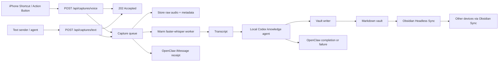

# System Design

This document is the source-of-truth design record for Denx, the current local-first knowledge capture system.

Related agent behavior policy:

- [docs/agent-storage-policy.md](/Users/dbillorgmail.com/Documents/personal operating system/docs/agent-storage-policy.md)

## Goal

Create a local-first personal knowledge system where a single action on iPhone captures spoken input, transcribes it, classifies it, stores it as durable markdown, and keeps the resulting vault available across devices.

## Current Working System

The implemented system is:

`iPhone Shortcut -> HTTP capture endpoint -> background queue -> warm Whisper worker -> local Codex knowledge agent -> markdown vault -> OpenClaw notifications -> Obsidian Sync`

This is running locally on the Mac and writes directly into the Obsidian-compatible vault at [`vault/`](/Users/dbillorgmail.com/Documents/personal operating system/vault).

## Design Principles

- Local vault files are the source of truth.
- Only one subsystem should write the vault.
- Raw transcripts are retained, but they are not the main knowledge surface.
- OpenClaw handles communication and later orchestration, not primary markdown editing.
- The iPhone stays simple and acts only as a capture client.

## Component Ownership

### iPhone Shortcut / Text Sender

- Records raw audio.
- Sends the recording to `POST /api/captures/voice`.
- Uses a bearer token for authorization.
- Can be bound to the Action Button.
- Other local tools or agents can send direct text to `POST /api/captures/text`.

### Capture Server

- Implemented in [`src/server/app.ts`](/Users/dbillorgmail.com/Documents/personal operating system/src/server/app.ts).
- Accepts multipart form uploads and raw file uploads.
- Returns `202 Accepted` immediately.
- Exposes capture status for asynchronous processing.

### Background Queue

- Implemented in [`src/lib/services/CaptureQueueService.ts`](/Users/dbillorgmail.com/Documents/personal operating system/src/lib/services/CaptureQueueService.ts).
- Decouples the HTTP request from heavy processing.
- Sends immediate receipt notifications.
- Runs transcription and vault updates off the request path.

### Transcription Layer

- Implemented in [`src/lib/services/LocalWhisperTranscriptionService.ts`](/Users/dbillorgmail.com/Documents/personal operating system/src/lib/services/LocalWhisperTranscriptionService.ts).
- Backed by [`scripts/transcribe_local_worker.py`](/Users/dbillorgmail.com/Documents/personal operating system/scripts/transcribe_local_worker.py).
- Uses `faster-whisper` with `large-v3`.
- Keeps the model warm in memory for repeated use.
- Runs locally on the Mac rather than on the phone.

### Knowledge Agent

- Implemented through local Codex CLI in [`src/lib/agent/CodexCliAgent.ts`](/Users/dbillorgmail.com/Documents/personal operating system/src/lib/agent/CodexCliAgent.ts).
- Guided by [`prompts/personal-knowledge-codex.md`](/Users/dbillorgmail.com/Documents/personal operating system/prompts/personal-knowledge-codex.md).
- Interprets captures as one of:
  - `note`
  - `task`
  - `decision`
  - `reminder`
  - `project-update`
- Produces structured plans for vault updates instead of writing raw transcripts as knowledge notes.

### Vault Writer

- Implemented primarily in [`src/lib/services/IngestionService.ts`](/Users/dbillorgmail.com/Documents/personal operating system/src/lib/services/IngestionService.ts) and [`src/lib/vault/VaultStore.ts`](/Users/dbillorgmail.com/Documents/personal operating system/src/lib/vault/VaultStore.ts).
- Writes markdown directly to disk.
- Maintains frontmatter, tags, related-note sections, backlinks, daily logs, and transcript references.
- Keeps `_system/transcripts/` and `_system/audio/` as machine-facing provenance, not the main knowledge graph.

### OpenClaw / G-Man

- Currently used for outbound iMessage notifications through [`src/lib/services/NotificationService.ts`](/Users/dbillorgmail.com/Documents/personal operating system/src/lib/services/NotificationService.ts).
- Receives:
  - receipt notifications
  - completion notifications
  - failure notifications
- The sibling workspace documentation was updated so OpenClaw understands that voice events are structured system events and that vault writing remains owned by this repository.

### Obsidian Sync

- Uses Obsidian Headless (`ob`) on this Mac.
- Syncs the vault to the remote Obsidian Sync vault `Personal Operating System`.
- Runs continuously in the background using:
  - [`scripts/obsidian-sync-continuous.sh`](/Users/dbillorgmail.com/Documents/personal operating system/scripts/obsidian-sync-continuous.sh)
  - [`scripts/install-obsidian-sync-launchagent.sh`](/Users/dbillorgmail.com/Documents/personal operating system/scripts/install-obsidian-sync-launchagent.sh)
  - [`launchd/com.dbillor.voice-kb.obsidian-headless-sync.plist`](/Users/dbillorgmail.com/Documents/personal operating system/launchd/com.dbillor.voice-kb.obsidian-headless-sync.plist)

## End-to-End Flow

## Vault Data Model

The vault currently uses:

- `daily/`
- `decisions/`
- `notes/`
- `projects/`
- `projects/updates/`
- `reminders/`
- `tasks/`
- `_memory/`
- `_system/audio/`
- `_system/transcripts/`
- `_system/index.json`

Each durable note includes:

- frontmatter metadata
- title
- durable written summary
- related-note links
- backlinks
- source transcript reference
- source audio reference when applicable

## Agent Storage Policy

The knowledge agent is now explicitly instructed to:

- preserve durable project, design, decision, and system information
- avoid promoting greetings, banter, and low-context captures into first-class knowledge
- treat raw audio and transcripts as provenance in `_system`
- prefer canonical project/system notes over fragmented duplicates
- turn architectural rules and clarified operating boundaries into decision notes or project updates

Full policy:

- [docs/agent-storage-policy.md](/Users/dbillorgmail.com/Documents/personal operating system/docs/agent-storage-policy.md)

## Why Direct File Writes Instead Of Obsidian CLI

Primary write path is direct file editing.

Reasons:

- markdown on disk is the actual durable asset
- background automation should not depend on the desktop app being open
- direct writes are easier to test, diff, and repair
- the vault writer can enforce stable conventions itself

Obsidian CLI remains useful as a secondary tool, but not as the core persistence path.

## OpenClaw Integration

The system intentionally splits responsibilities:

- this repository owns capture, transcription, vault reasoning, and vault writes
- OpenClaw owns messaging and the future conversation/orchestration surface

This avoids the main failure mode: two different agents mutating the same vault independently.

Current OpenClaw work completed:

- outbound iMessage path configured
- receipt/completion/failure notifications wired into the queue and ingestion pipeline
- sibling `openclaw` workspace docs updated to record the contract

Recommended long-term shape:

`iPhone -> capture queue -> transcription -> transcript fan-out`

- scribe path:
  - Codex knowledge worker updates the vault
- conversation path:
  - G-Man / OpenClaw replies conversationally and may trigger additional workflows

## Sync Model

The vault is now configured for always-on private sync using Obsidian Headless on this Mac.

Rules:

- this Mac is the source-of-truth writer
- Headless Sync runs on this Mac
- other devices use normal Obsidian Sync clients
- do not enable the Obsidian desktop app's Sync plugin on this same Mac while Headless Sync is active

## Known UX Constraints

- The current iPhone capture surface is a Shortcut, not a native app.
- Shortcut-based `Record Audio` still uses iPhone UI behavior for stopping recordings.
- The HTTP timeout issue has been solved by moving processing behind an asynchronous queue, but the recording-stop UX is still constrained by Shortcuts itself.

## Current State Summary

Implemented and working:

- iPhone raw-audio upload
- immediate `202 Accepted`
- background job processing
- warm local Whisper transcription
- local Codex knowledge shaping
- direct markdown vault writes
- OpenClaw iMessage notifications
- linked project/task/note generation
- Obsidian Headless sync configuration and background launch agent

Next major improvements:

- canonical long-term memory layer under the vault
- better project/person/topic hub notes
- transcript routing so some captures are scribe-only, some are conversational, and some do both
- deeper OpenClaw/G-Man orchestration without giving it parallel vault-write ownership
