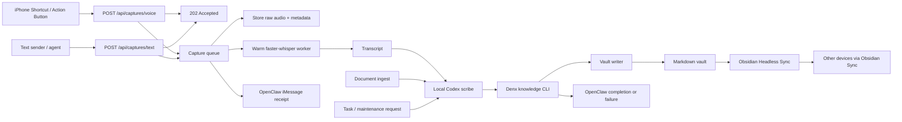

# System Design

This document is the source-of-truth design record for Denx, the current local-first knowledge capture system.

Related agent behavior policy:

- [docs/agent-storage-policy.md](agent-storage-policy.md)

## Goal

Create a local-first personal knowledge system where a single action on iPhone or a local task/document request flows through a prompt-driven scribe, updates durable markdown, and keeps the resulting vault available across devices.

## Current Working System

The implemented system is:

`voice/text/document input -> context pack -> local Codex scribe -> Denx knowledge CLI -> markdown vault -> OpenClaw notifications -> Obsidian Sync`

This is running locally on the Mac and writes directly into the Obsidian-compatible vault at `vault/`.

## Design Principles

- Local vault files are the source of truth.
- Only one subsystem should write the vault.
- Raw transcripts are retained, but they are not the main knowledge surface.
- Raw source documents and extracted text are retained as provenance.
- OpenClaw handles communication and later orchestration, not primary markdown editing.
- The iPhone stays simple and acts only as a capture client.
- Only one writer commits durable graph changes.

## Component Ownership

### iPhone Shortcut / Text Sender

- Records raw audio.
- Sends the recording to `POST /api/captures/voice`.
- Uses a bearer token for authorization.
- Can be bound to the Action Button.
- Other local tools or agents can send direct text to `POST /api/captures/text`.
- The external phone UX stays unchanged in v3 Phase 1.

### Capture Server

- Implemented in [`src/server/app.ts`](../src/server/app.ts).
- Accepts multipart form uploads and raw file uploads.
- Returns `202 Accepted` immediately.
- Exposes capture status for asynchronous processing.

### Background Queue

- Implemented in [`src/lib/services/CaptureQueueService.ts`](../src/lib/services/CaptureQueueService.ts).
- Decouples the HTTP request from heavy processing.
- Sends immediate receipt notifications.
- Runs transcription and vault updates off the request path.

### Transcription Layer

- Implemented in [`src/lib/services/LocalWhisperTranscriptionService.ts`](../src/lib/services/LocalWhisperTranscriptionService.ts).
- Backed by [`scripts/transcribe_local_worker.py`](../scripts/transcribe_local_worker.py).
- Uses `faster-whisper` with `large-v3`.
- Keeps the model warm in memory for repeated use.
- Runs locally on the Mac rather than on the phone.

### Knowledge Agent

- Implemented through local Codex CLI in [`src/lib/agent/CodexCliAgent.ts`](../src/lib/agent/CodexCliAgent.ts).
- Guided by [`prompts/personal-knowledge-codex.md`](../prompts/personal-knowledge-codex.md).
- Uses one unified `runScribeTask(...)` contract for:
  - capture work
  - task-driven knowledge work
  - maintenance work
  - document ingestion work
- Produces a single scribe plan with graph actions instead of separate capture/ask/organize plan types.

### Denx Knowledge CLI

- Implemented in [`src/lib/services/KnowledgeCliService.ts`](../src/lib/services/KnowledgeCliService.ts).
- Owns the mechanical action surface for the scribe:
  - search
  - read
  - related
  - diff-plan
  - commit-plan
  - create/update/append/link
  - merge/archive
  - memory/document/transcript recording
- Enforces provenance-safe validation so `_system` provenance is not mutated by graph actions.

### Vault Writer

- Implemented primarily in [`src/lib/vault/VaultStore.ts`](../src/lib/vault/VaultStore.ts).
- Still writes markdown directly to disk.
- Now sits behind the Denx knowledge CLI for durable graph edits.
- Maintains frontmatter, tags, related-note sections, backlinks, daily logs, and source references.
- Keeps `_system/transcripts/`, `_system/audio/`, `_system/sources/`, and `_system/extractions/` as provenance, not the main knowledge graph.

### Document Ingestion

- Implemented in [`src/lib/services/DocumentIngestionService.ts`](../src/lib/services/DocumentIngestionService.ts).
- Supports Markdown, text, and PDF inputs.
- Copies source documents into immutable provenance under `_system/sources/docs/`.
- Writes extraction output under `_system/extractions/docs/`.
- Sends extracted content through the same scribe path used by voice/text/task work.

### OpenClaw / G-Man

- Currently used for outbound iMessage notifications through [`src/lib/services/NotificationService.ts`](../src/lib/services/NotificationService.ts).
- Receives:
  - receipt notifications
  - completion notifications
  - failure notifications
- The sibling workspace documentation was updated so OpenClaw understands that voice events are structured system events and that vault writing remains owned by this repository.

### Obsidian Sync

- Uses Obsidian Headless (`ob`) on this Mac.
- Syncs the vault to the remote Obsidian Sync vault `Personal Operating System`.
- Runs continuously in the background using:
  - [`scripts/obsidian-sync-continuous.sh`](../scripts/obsidian-sync-continuous.sh)
  - [`scripts/install-obsidian-sync-launchagent.sh`](../scripts/install-obsidian-sync-launchagent.sh)
  - [`launchd/com.dbillor.voice-kb.obsidian-headless-sync.plist`](../launchd/com.dbillor.voice-kb.obsidian-headless-sync.plist)

## End-to-End Flow

## Vault Data Model

The vault currently uses:

- `daily/`
- `decisions/`
- `notes/`
  - `documents/`
- `projects/`
- `projects/updates/`
- `reminders/`
- `tasks/`
- `_memory/`
- `_system/audio/`
- `_system/extractions/`
- `_system/sources/`
- `_system/transcripts/`
- `_system/index.json`

Each durable note includes:

- frontmatter metadata
- title
- durable written summary
- related-note links
- backlinks
- source transcript reference
- source audio reference when applicable

In addition to creating or updating the main note, the scribe path can now:

- strengthen related canonical notes for people, projects, systems, and topics
- append durable owner-level context into `_memory/` when the capture reveals stable identity, preference, principle, or open-question information
- record document-facing notes from imported sources
- merge duplicate knowledge notes
- archive stale knowledge notes without touching provenance

## Agent Storage Policy

The knowledge agent is now explicitly instructed to:

- preserve durable project, design, decision, and system information
- preserve relevant people and relationship context as durable memory
- avoid promoting greetings, banter, and low-context captures into first-class knowledge
- treat raw audio, transcripts, source documents, and extracted text as provenance in `_system`
- prefer canonical project/system notes over fragmented duplicates
- turn architectural rules and clarified operating boundaries into decision notes or project updates
- use one scribe plan contract rather than separate planner types

Full policy:

- [docs/agent-storage-policy.md](agent-storage-policy.md)

## Why Direct File Writes Instead Of Obsidian CLI

Primary persistence remains direct file editing.

Reasons:

- markdown on disk is the actual durable asset
- background automation should not depend on the desktop app being open
- direct writes are easier to test, diff, and repair
- Denx needs graph-aware operations beyond generic app automation
- a Denx-specific CLI is a better agent surface than raw file surgery

Obsidian CLI remains useful as a secondary tool, but not as the core persistence path.

## OpenClaw Integration

The system intentionally splits responsibilities:

- this repository owns capture, transcription, vault reasoning, and vault writes
- OpenClaw owns messaging and the future conversation/orchestration surface

This avoids the main failure mode: two different agents mutating the same vault independently.

Current OpenClaw work completed:

- outbound iMessage path configured
- receipt/completion/failure notifications wired into the queue and ingestion pipeline
- sibling `openclaw` workspace docs updated to record the contract

Recommended long-term shape:

`iPhone -> capture queue -> transcription -> transcript fan-out`

- scribe path:
  - Codex knowledge worker updates the vault
- conversation path:
  - G-Man / OpenClaw replies conversationally and may trigger additional workflows

## Sync Model

The vault is now configured for always-on private sync using Obsidian Headless on this Mac.

Rules:

- this Mac is the source-of-truth writer
- Headless Sync runs on this Mac
- other devices use normal Obsidian Sync clients
- do not enable the Obsidian desktop app's Sync plugin on this same Mac while Headless Sync is active

## Known UX Constraints

- The current iPhone capture surface is a Shortcut, not a native app.
- Shortcut-based `Record Audio` still uses iPhone UI behavior for stopping recordings.
- The HTTP timeout issue has been solved by moving processing behind an asynchronous queue, but the recording-stop UX is still constrained by Shortcuts itself.

## Current State Summary

Implemented and working:

- iPhone raw-audio upload
- immediate `202 Accepted`
- background job processing
- warm local Whisper transcription
- prompt-driven local Codex scribe
- Denx knowledge CLI with plan diff/commit flow
- direct markdown persistence behind the CLI layer
- document ingest for Markdown, text, and PDF inputs
- OpenClaw iMessage notifications
- linked project/task/note generation
- Obsidian Headless sync configuration and background launch agent

Next major improvements:

- richer read-only subagent orchestration
- better project/person/topic hub maintenance heuristics
- transcript routing so some captures are scribe-only, some are conversational, and some do both
- deeper OpenClaw/G-Man orchestration without giving it parallel vault-write ownership
